# RSA-2048 IP 設計仕様書

**作成日**: 2026年4月8日
**更新日**: 2026年4月10日
**作成者**: a2zime × Claude Code
**バージョン**: 1.1
**前提ドキュメント**: [要求仕様書](requirements.md)

---

## 1. 概要

本ドキュメントは RSA-2048 IP の設計仕様を定義する。
要求仕様に基づき、モンゴメリ乗算を用いたモジュラー累乗エンジンのアーキテクチャ、
モジュール分割、各モジュールの詳細仕様を記述する。

---

## 2. モジュール階層

### 2.1 テキスト階層

```
rsa_top                     トップレベル統合
├── io_controller           32bit シリアル I/O（Valid/Ready ハンドシェイク）
├── mod_exp                 モジュラー累乗（Square-and-Multiply）
│   └── mont_mul            モンゴメリ乗算（FIOS, 32bit ワード）
│       └── mul_add_unit    32×32 積和演算（DSP48E1 ラッパー）
├── crt_controller          CRT オーケストレーション
└── operand_mem             デュアルポート BRAM オペランドストレージ

rsa_pkg.sv                  パッケージ（アドレスマップ定数・型定義）
```

### 2.2 ブロック図

上位モジュール `rsa_top` の境界を外枠で表す。本IPのスコープ外である
AXI-Lite ラッパーおよびホストとの関係も点線で明示する。

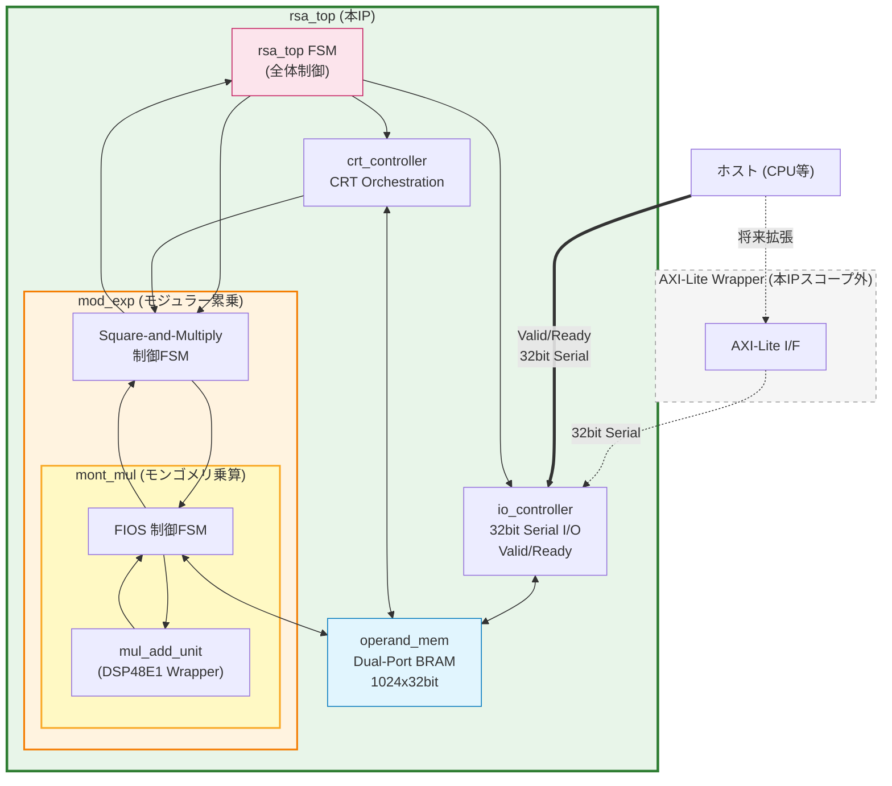

### 2.3 信号接続図

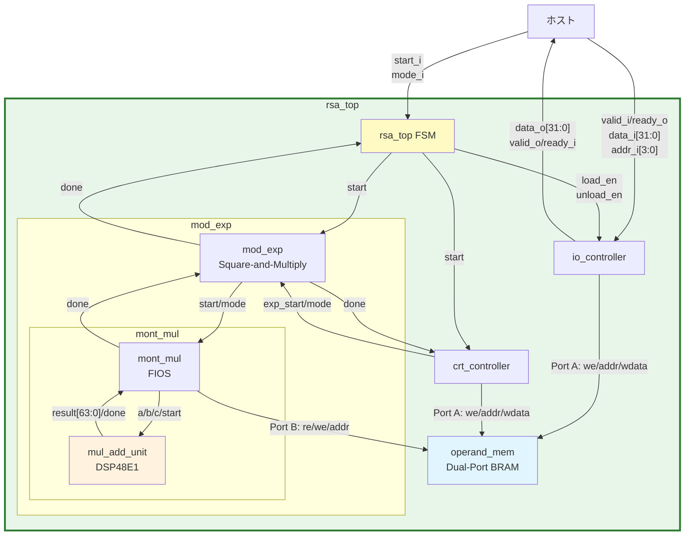

---

## 3. パッケージ定義（rsa_pkg.sv）

### 3.1 アドレスマップ定数

全オペランドを 1 つの共有メモリに配置する。アドレスはワード（32bit）単位。

```systemverilog
package rsa_pkg;

  localparam int unsigned KEY_WIDTH  = 2048;
  localparam int unsigned WORD_WIDTH = 32;
  localparam int unsigned NUM_WORDS  = KEY_WIDTH / WORD_WIDTH;  // 64

  // メモリアドレスマップ（ワードアドレス）
  localparam int unsigned ADDR_BASE     = 10'h000;  // base（メッセージ/暗号文） 64w
  localparam int unsigned ADDR_EXP      = 10'h040;  // 指数 e or d              64w
  localparam int unsigned ADDR_MOD      = 10'h080;  // モジュラス n             64w
  localparam int unsigned ADDR_RSQ      = 10'h0C0;  // R^2 mod n               64w
  localparam int unsigned ADDR_RESULT   = 10'h100;  // 演算結果                 64w
  localparam int unsigned ADDR_MONT_A   = 10'h140;  // モンゴメリ形式 base      64w
  localparam int unsigned ADDR_MONT_T   = 10'h180;  // モンゴメリ中間値 t[]     65w
  localparam int unsigned ADDR_P        = 10'h1C0;  // CRT: p                  32w
  localparam int unsigned ADDR_Q        = 10'h1E0;  // CRT: q                  32w
  localparam int unsigned ADDR_DP       = 10'h200;  // CRT: dp                 32w
  localparam int unsigned ADDR_DQ       = 10'h220;  // CRT: dq                 32w
  localparam int unsigned ADDR_QINV     = 10'h240;  // CRT: qinv               32w
  localparam int unsigned ADDR_RSQ_P    = 10'h260;  // CRT: R^2 mod p          32w
  localparam int unsigned ADDR_RSQ_Q    = 10'h280;  // CRT: R^2 mod q          32w
  localparam int unsigned ADDR_M1       = 10'h2A0;  // CRT 中間値: m1          32w
  localparam int unsigned ADDR_M2       = 10'h2C0;  // CRT 中間値: m2          32w
  localparam int unsigned ADDR_HQ       = 10'h2E0;  // CRT 中間値: h*q         64w
  localparam int unsigned ADDR_BASE_P   = 10'h320;  // CRT: base mod p         32w
  localparam int unsigned ADDR_BASE_Q   = 10'h340;  // CRT: base mod q         32w

  // パラメータアドレスエンコーディング（addr_i[3:0]）
  typedef enum logic [3:0] {
    ParamBase   = 4'h0,
    ParamExp    = 4'h1,
    ParamMod    = 4'h2,
    ParamRSq    = 4'h3,
    ParamNPrime = 4'h4,
    ParamP      = 4'h5,
    ParamQ      = 4'h6,
    ParamDp     = 4'h7,
    ParamDq     = 4'h8,
    ParamQinv   = 4'h9,
    ParamRSqP   = 4'hA,
    ParamRSqQ   = 4'hB,
    ParamNpP    = 4'hC,
    ParamNqP    = 4'hD,
    ParamBasP   = 4'hE,
    ParamBasQ   = 4'hF
  } param_addr_e;

endpackage
```

### 3.2 メモリマップ概要

| ベースアドレス | サイズ(word) | 内容 |
|---|---|---|
| 0x000 | 64 | base（メッセージ/暗号文） |
| 0x040 | 64 | 指数（e or d） |
| 0x080 | 64 | モジュラス n |
| 0x0C0 | 64 | R^2 mod n |
| 0x100 | 64 | 演算結果 |
| 0x140 | 64 | モンゴメリ形式 base |
| 0x180 | 65 | モンゴメリ中間値 t[] |
| 0x1C0 | 32 | p |
| 0x1E0 | 32 | q |
| 0x200 | 32 | dp |
| 0x220 | 32 | dq |
| 0x240 | 32 | qinv |
| 0x260 | 32 | R^2 mod p |
| 0x280 | 32 | R^2 mod q |
| 0x2A0 | 32 | CRT中間値 m1 |
| 0x2C0 | 32 | CRT中間値 m2 |
| 0x2E0 | 64 | CRT中間値 h*q |
| 0x320 | 32 | CRT: base mod p |
| 0x340 | 32 | CRT: base mod q |

合計: ~880 ワード = 28,160 bit → BRAM36K 1 個（36,864 bit）に収容可能。

n_prime, np_prime, nq_prime（各32bit）は単一値のため BRAM ではなくレジスタに保持する。

---

## 4. モジュール詳細仕様

### 4.1 rsa_top — トップレベルモジュール

**責務:** I/Oコントローラ、CRTコントローラ、モジュラー累乗エンジン、
オペランドメモリ間のデータルーティングと全体制御。

**ポート定義:**

```systemverilog
module rsa_top #(
  parameter int unsigned KeyWidth  = 2048,
  parameter int unsigned WordWidth = 32
) (
  input  logic                  clk,
  input  logic                  rst_n,
  // 入力インターフェース
  input  logic                  valid_i,
  output logic                  ready_o,
  input  logic                  mode_i,       // 0: 公開鍵演算, 1: CRT秘密鍵演算
  input  logic [3:0]            addr_i,       // パラメータ ID（ワードアドレスではない）
  input  logic [WordWidth-1:0]  data_i,       // 32bit シリアル入力
  // 出力インターフェース
  output logic                  valid_o,
  input  logic                  ready_i,
  output logic [WordWidth-1:0]  data_o,       // 32bit シリアル出力
  // 制御
  input  logic                  start_i,      // 演算開始トリガ
  output logic                  busy_o        // 演算中フラグ
);
```

**状態機械:**

```systemverilog
typedef enum logic [2:0] {
  StIdle,     // パラメータ入力待ち / 開始待ち
  StLoad,     // パラメータロード中（I/O経由）
  StPubExp,   // 公開鍵演算（2048bit直接累乗）
  StCrt,      // CRT秘密鍵演算（crt_controllerに委譲）
  StUnload    // 演算結果出力中（I/O経由）
} rsa_top_state_e;
```

**状態遷移図:**

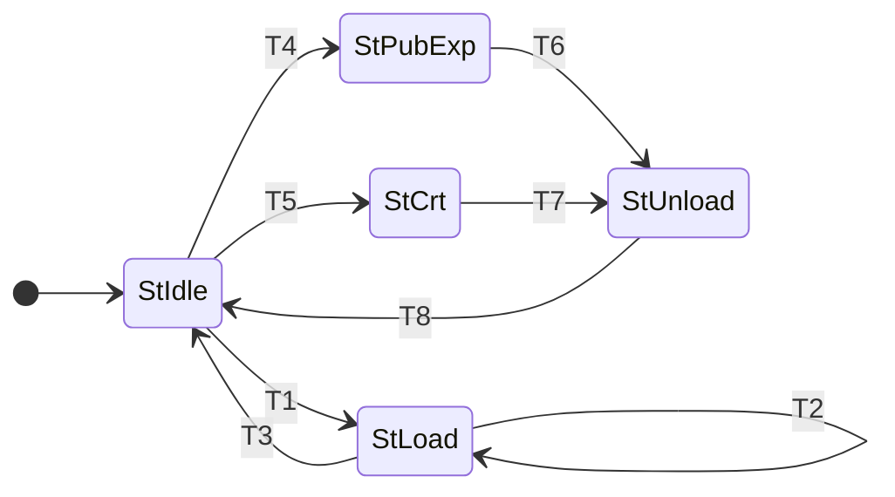

**遷移条件:**

| ID | 遷移 | 条件 |
|---|---|---|
| T1 | StIdle → StLoad | `(valid_i & ready_o)`（ハンドシェイク成立）|
| T2 | StLoad → StLoad | `(word_cnt < N-1) & (valid_i & ready_o)`（カウンタ進行） |
| T3 | StLoad → StIdle | `(word_cnt == N-1) & (valid_i & ready_o)`（load_done パルス） |
| T4 | StIdle → StPubExp | `start_i & (mode_i == 0)` |
| T5 | StIdle → StCrt | `start_i & (mode_i == 1)` |
| T6 | StPubExp → StUnload | `exp_done` |
| T7 | StCrt → StUnload | `crt_done` |
| T8 | StUnload → StIdle | `(word_cnt == N-1) & (valid_o & ready_i)`（unload_done パルス） |

**補足:**
- `N` はパラメータのワード数（2048bit=64、1024bit=32、32bit=1）であり、
  `addr_i` から自動決定される。
- `addr_i` のセマンティクス（パラメータ ID + 内部ワードカウンタ方式）は §11.4 を参照。
- `word_cnt` は io_controller 内のワードカウンタ。
- 複数パラメータの連続ロード時は、1パラメータ分のロード完了ごとに
  StLoad→StIdle に戻り、次の valid_i を待つ。

**タイミングチャート:**

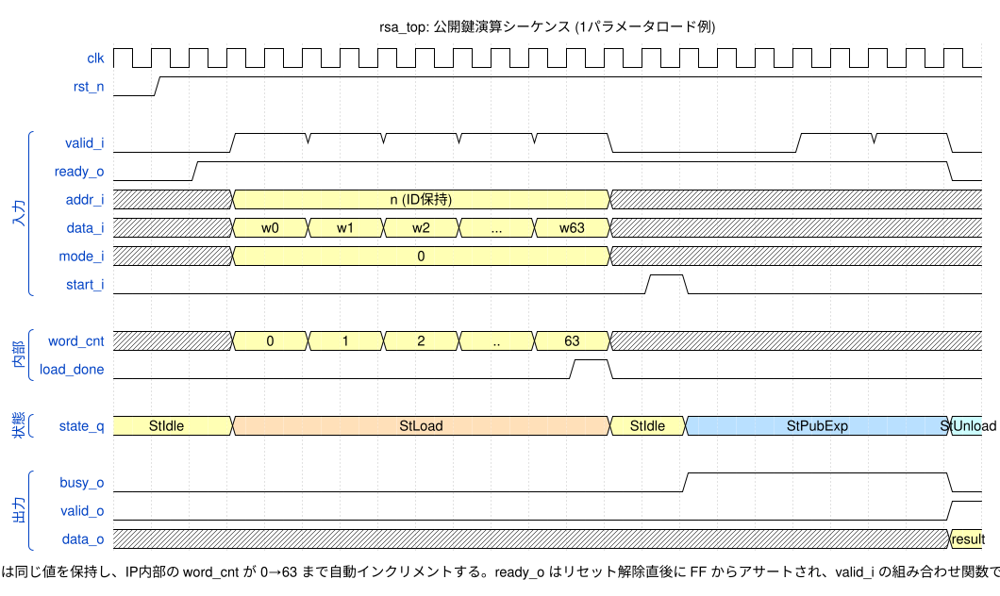

**タイミングチャートの補足:**
- `ready_o` は FF 出力であり、`valid_i` の組み合わせ関数ではない。
  リセット解除後、StIdle で空き状態となった時点でアサートされる
  （=ロード受付可能）。valid_i が到着しても 1 クロック以内に
  ready_o が即応する必要はない（ただし実装上は即応可能）。
- `load_done_o` は io_controller の内部カウンタが最終ワード
  （例: 64ワードパラメータなら `(word_cnt == 63) & (valid_i & ready_o)`）に
  達した次のクロックでアサートされ、rsa_top FSM が StLoad→StIdle 遷移を
  検知するトリガとなる（1クロックのパルス）。

---

### 4.2 io_controller — シリアル I/O コントローラ

**責務:** 32bit ワードを Valid/Ready ハンドシェイクで受信し、addr_i で指定された
パラメータ領域にオペランドメモリへ書き込む。出力時は結果領域から読み出して
32bit ワードで送信する。

**ポート定義:**

```systemverilog
module io_controller #(
  parameter int unsigned KeyWidth  = 2048,
  parameter int unsigned WordWidth = 32
) (
  input  logic                  clk,
  input  logic                  rst_n,
  // 外部インターフェース
  input  logic                  valid_i,
  output logic                  ready_o,
  input  logic [3:0]            addr_i,
  input  logic [WordWidth-1:0]  data_i,
  output logic                  valid_o,
  input  logic                  ready_i,
  output logic [WordWidth-1:0]  data_o,
  // 内部メモリインターフェース
  output logic                  mem_we_o,
  output logic [9:0]            mem_addr_o,
  output logic [WordWidth-1:0]  mem_wdata_o,
  input  logic [WordWidth-1:0]  mem_rdata_i,
  output logic                  mem_re_o,
  // 制御
  input  logic                  load_en_i,
  input  logic                  unload_en_i,
  output logic                  load_done_o,
  output logic                  unload_done_o
);
```

**状態機械:**

```systemverilog
typedef enum logic [1:0] {
  StIoIdle,
  StIoLoad,     // 32bit ワード受信 → メモリ書き込み
  StIoUnload    // メモリ読み出し → 32bit ワード送信
} io_state_e;
```

**状態遷移図:**

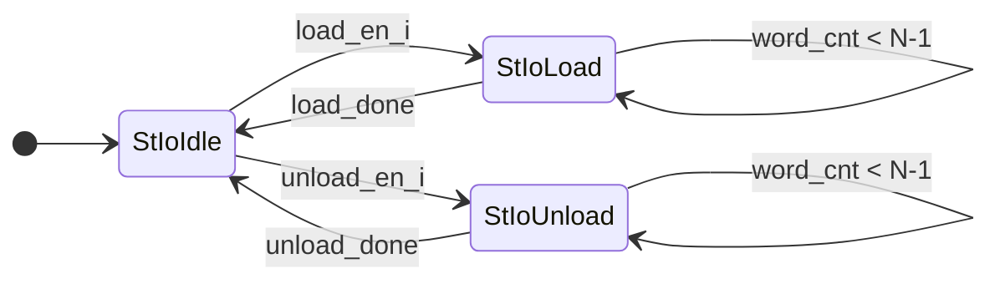

**遷移条件の詳細:**

| 遷移 | 条件 |
|---|---|
| StIoIdle → StIoLoad | `load_en_i` アサート |
| StIoLoad セルフループ | `(word_cnt < N-1) & (valid_i & ready_o)`（カウンタ進行） |
| StIoLoad → StIoIdle | `(word_cnt == N-1) & (valid_i & ready_o)`（load_done パルス） |
| StIoIdle → StIoUnload | `unload_en_i` アサート |
| StIoUnload セルフループ | `(word_cnt < N-1) & (valid_o & ready_i)`（カウンタ進行） |
| StIoUnload → StIoIdle | `(word_cnt == N-1) & (valid_o & ready_i)`（unload_done パルス） |

`N` は転送ワード数（64 or 32 or 1）で、`addr_i` から決定される。

**ワードカウンタ:**
- 6bit カウンタ（0..63 for 2048bit パラメータ, 0..31 for 1024bit パラメータ）
- 転送ワード数は addr_i から自動判定
  - 2048bit パラメータ（base, exp, n, R^2）: 64 ワード
  - 1024bit パラメータ（p, q, dp, dq, qinv, R^2_p, R^2_q）: 32 ワード
  - 32bit パラメータ（n_prime, np_prime, nq_prime）: 1 ワード

**バイトオーダー:** LSB-first（word[0] = 最下位 32bit）

`addr_i` のセマンティクス（パラメータ ID + 内部ワードカウンタ方式）の詳細は
§11.4 を参照。

**タイミングチャート:**

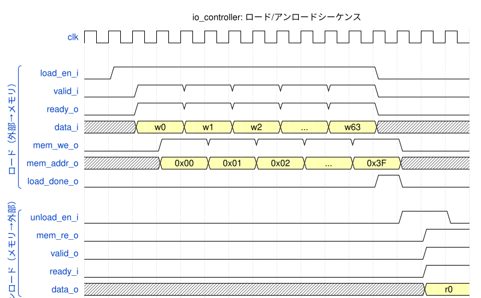

---

### 4.3 mod_exp — モジュラー累乗エンジン

**責務:** Left-to-right binary Square-and-Multiply をモンゴメリ乗算器を用いて実行する。
KeyWidth パラメータにより 2048bit（公開鍵）と 1024bit（CRT）の両方に対応。

**ポート定義:**

```systemverilog
module mod_exp #(
  parameter int unsigned MaxWidth  = 2048,
  parameter int unsigned WordWidth = 32
) (
  input  logic                  clk,
  input  logic                  rst_n,
  // 制御
  input  logic                  start_i,
  input  logic                  crt_mode_i,     // 0: 2048bit, 1: 1024bit
  output logic                  done_o,
  output logic                  busy_o,
  // メモリインターフェース
  output logic                  mem_re_o,
  output logic                  mem_we_o,
  output logic [9:0]            mem_addr_o,
  input  logic [WordWidth-1:0]  mem_rdata_i,
  output logic [WordWidth-1:0]  mem_wdata_o,
  // モンゴメリ乗算器インターフェース
  output logic                  mont_start_o,
  output logic                  mont_mode_o,    // 0: 2048bit, 1: 1024bit
  input  logic                  mont_done_i,
  input  logic                  mont_busy_i
);
```

**状態機械:**

```systemverilog
typedef enum logic [3:0] {
  StExpIdle,
  StExpToMont,         // base をモンゴメリ形式に変換（メモリコピー）
  StExpToMontWait,     // MontMul 完了待ち
  StExpInitR,          // result = R mod n を初期化（メモリコピー）
  StExpInitRWait,      // MontMul 完了待ち
  StExpScan,           // 指数ビット走査（メモリからワード読み出し）
  StExpSquare,         // result の二乗を開始（メモリコピー + MontMul 起動）
  StExpSquareWait,     // MontMul 完了待ち
  StExpMul,            // result × base を開始（メモリコピー + MontMul 起動）
  StExpMulWait,        // MontMul 完了待ち
  StExpFromMont,       // result をモンゴメリドメインから復帰（メモリコピー + MontMul 起動）
  StExpFromMontWait,   // MontMul 完了待ち
  StExpCopyResult,     // MontMul 結果のメモリコピー（t[] → 適切な領域）
  StExpDone            // 完了通知（最終結果を ADDR_RESULT にコピー）
} mod_exp_state_e;
```

各操作（ToMont, InitR, Square, Mul, FromMont）はメモリコピーフェーズ（オペランドの
配置）と MontMul 待ちフェーズに分離される。`StExpCopyResult` は MontMul 結果 t[] を
ADDR_BASE にコピーし、base_mont を ADDR_MONT_A に復元する汎用コピーステートである。

**状態遷移図:**

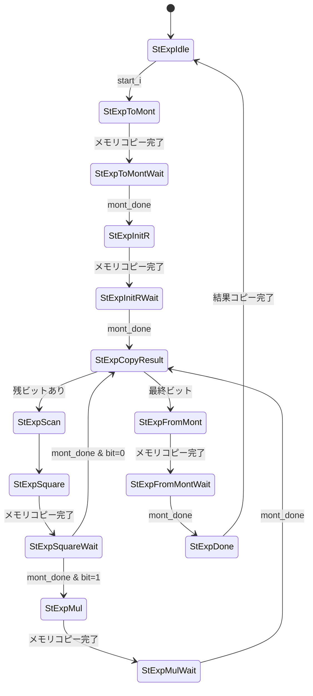

**指数ビット走査:**
- 指数はメモリ上に 64（または 32）ワードとして格納
- ビットカウンタが現在のビット位置を追跡
- 該当ワードをメモリから読み出し、該当ビットを抽出
- MSB（最上位ビット）から走査を開始

**タイミングチャート:**

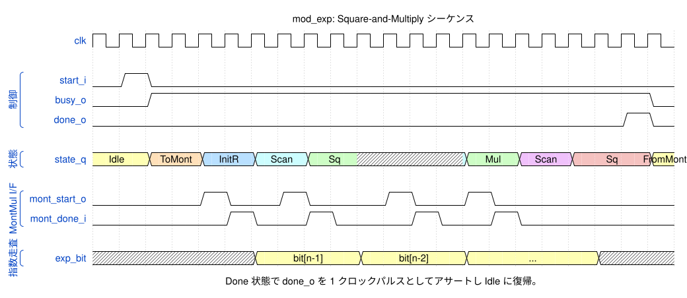

---

### 4.4 mont_mul — モンゴメリ乗算器（FIOS）

**責務:** `MontMul(a, b, n) = a * b * R^(-1) mod n` を FIOS アルゴリズムで
32bit ワード演算により計算する。

**ポート定義:**

```systemverilog
module mont_mul #(
  parameter int unsigned MaxWords  = 64,
  parameter int unsigned WordWidth = 32
) (
  input  logic                     clk,
  input  logic                     rst_n,
  // 制御
  input  logic                     start_i,
  input  logic                     half_mode_i,   // 0: 64ワード(2048bit), 1: 32ワード(1024bit)
  output logic                     done_o,
  output logic                     busy_o,
  // メモリインターフェース（a, b, n 読み出し / t 読み書き）
  output logic                     mem_re_o,
  output logic                     mem_we_o,
  output logic [9:0]               mem_addr_o,
  input  logic [WordWidth-1:0]     mem_rdata_i,
  output logic [WordWidth-1:0]     mem_wdata_o,
  // n_prime[0]（前計算済み 32bit 定数）
  input  logic [WordWidth-1:0]     n_prime_i,
  // 積和演算ユニットインターフェース
  output logic [WordWidth-1:0]     mul_a_o,
  output logic [WordWidth-1:0]     mul_b_o,
  output logic [WordWidth-1:0]     mul_c_o,
  output logic                     mul_start_o,
  input  logic [2*WordWidth-1:0]   mul_result_i,
  input  logic                     mul_done_i
);
```

**内部記憶:**
- `t[]`: 中間結果配列（65 ワード）。BRAM の一部領域（ADDR_MONT_T）に配置。
- `carry_q`: 33bit キャリーレジスタ。

**状態機械:**

```systemverilog
typedef enum logic [3:0] {
  StMontIdle,
  StMontOuterInit,       // 外部ループ初期化: b[i] リード要求
  StMontLoadBi,          // BRAM レイテンシ待ち、b[i] ラッチ、t[0] プリフェッチ
  StMontInnerFirst,      // j=0: a[0] リード要求、t[0] 受信準備
  StMontInnerFirstWait,  // t[0] ラッチ → a[0]*b[i]+t[0] → (C,S) 算出
  StMontComputeM,        // m = S * n_prime[0] mod W（組み合わせ乗算）; n[0] プリフェッチ
  StMontMN0,             // m*n[0] セットアップ
  StMontMN0Wait,         // m*n[0]+S → キャリー算出; 内部ループ準備
  StMontInnerLoop,       // j=1..s-1: a[j]*b[i] + t[j] → m*n[j] + S（サブステート制御）
  StMontInnerLoopWait,   // （未使用: 待機はサブステートで処理）
  StMontInnerStore,      // t[j-1] = S; 次 j のプリフェッチ
  StMontOuterEnd,        // t[s-1] = C; i インクリメント
  StMontFinalSub,        // 条件付き減算: 比較フェーズまたは書き戻しフェーズの開始
  StMontWriteBack,       // 比較/減算のワード単位実行（サブステート制御）
  StMontDone
} mont_mul_state_e;
```

BRAM 読み出しの 1 サイクルレイテンシおよび mul_add_unit の 5 サイクルパイプラインに
対応するため、Wait/Load ステートが追加されている。`StMontInnerLoop` と `StMontWriteBack`
は `inner_sub_q` サブステートカウンタにより内部で複数フェーズを制御する。

**状態遷移図:**

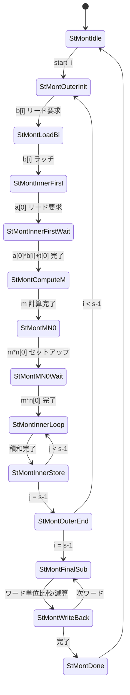

**内部ループのサイクル内訳（1 イテレーション j あたり）:**
1. `a[j]` をメモリから読み出し、`a[j] * b[i]` 乗算開始
2. `t[j]` と キャリーで蓄積
3. `n[j]` をメモリから読み出し、`m * n[j]` 乗算開始
4. 蓄積して `t[j-1]` を格納

メモリ読み出しと DSP 演算のパイプライニングにより、内部ループは約 6 サイクル。

**タイミングチャート:**

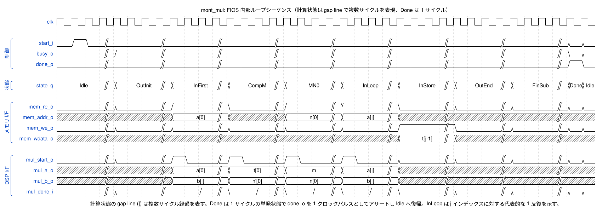

---

### 4.5 mul_add_unit — 32×32 積和演算ユニット

**責務:** DSP48E1 をラップし、`a * b + c` 演算を実行して 64bit 結果を出力する。

**ポート定義:**

```systemverilog
module mul_add_unit #(
  parameter int unsigned WordWidth = 32
) (
  input  logic                     clk,
  input  logic                     rst_n,
  input  logic [WordWidth-1:0]     a_i,
  input  logic [WordWidth-1:0]     b_i,
  input  logic [WordWidth-1:0]     c_i,
  input  logic                     start_i,
  output logic [2*WordWidth-1:0]   result_o,
  output logic                     done_o
);
```

**実装方針:**

Spartan-7 の DSP48E1 は 25×18 bit の乗算器を内蔵。32×32 乗算は以下のように分割する。

```
a[31:0] = {a_hi[15:0], a_lo[15:0]}
b[31:0] = {b_hi[15:0], b_lo[15:0]}

result = a_lo * b_lo
       + (a_lo * b_hi) << 16
       + (a_hi * b_lo) << 16
       + (a_hi * b_hi) << 32
       + c
```

1 個の DSP48E1 で 4 回の部分積を順次計算し、シフト加算で合成する。

| サイクル | 演算 |
|---|---|
| 1 | 入力ラッチ（a, b, c をレジスタに保持）、cycle_q=0 |
| 2 | a_lo × b_lo + c |
| 3 | + (a_lo × b_hi) << 16 |
| 4 | + (a_hi × b_lo) << 16 |
| 5 | + (a_hi × b_hi) << 32 → done_o アサート |

レイテンシ: 5 サイクル（入力ラッチ 1 + 部分積 4）。start_i から done_o まで 5 クロック。

**タイミングチャート:**

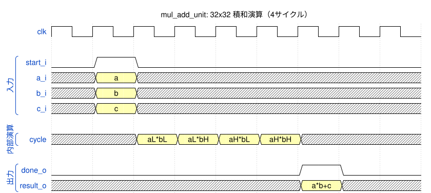

---

### 4.6 crt_controller — CRT オーケストレーション

**責務:** CRT ベースの秘密鍵演算を制御する。2 回の 1024bit モジュラー累乗と
最終 CRT 再結合を順序制御する。

**ポート定義:**

```systemverilog
module crt_controller #(
  parameter int unsigned KeyWidth  = 2048,
  parameter int unsigned WordWidth = 32
) (
  input  logic                  clk,
  input  logic                  rst_n,
  // 制御
  input  logic                  start_i,
  output logic                  done_o,
  output logic                  busy_o,
  // mod_exp 制御
  output logic                  exp_start_o,
  output logic                  exp_crt_mode_o,
  input  logic                  exp_done_i,
  input  logic                  exp_busy_i,
  // mont_mul 直接制御（MulQinv で使用）
  output logic                  mont_start_o,
  output logic                  mont_mode_o,
  input  logic                  mont_done_i,
  input  logic                  mont_busy_i,
  // n_prime 選択（1 = nq_prime 使用, 0 = np_prime 使用）
  output logic                  use_nq_prime_o,
  // メモリインターフェース
  output logic                  mem_we_o,
  output logic                  mem_re_o,
  output logic [9:0]            mem_addr_o,
  output logic [WordWidth-1:0]  mem_wdata_o,
  input  logic [WordWidth-1:0]  mem_rdata_i,
  // DSP（mul_add_unit）インターフェース
  // StCrtMulHQ で mul_add_unit を直接駆動する
  // （mont_mul が Idle の期間のみ使用するため調停は不要）
  output logic                  mul_start_o,
  output logic [WordWidth-1:0]  mul_a_o,
  output logic [WordWidth-1:0]  mul_b_o,
  output logic [WordWidth-1:0]  mul_c_o,
  input  logic [2*WordWidth-1:0] mul_result_i,
  input  logic                  mul_done_i
);
```

**CRT アルゴリズム:**

```
1. m1 = base^dp mod p       （1024bit モジュラー累乗）
2. m2 = base^dq mod q       （1024bit モジュラー累乗）
3. h  = qinv × (m1 - m2) mod p  （1024bit モンゴメリ乗算 + 条件付き加算）
4. result = m2 + h × q          （2048bit 乗算 + 加算）
```

**状態機械:**

```systemverilog
typedef enum logic [3:0] {
  StCrtIdle,
  StCrtReduceP,       // base_p/dp/p/R^2_p を ADDR_BASE/EXP/MOD/RSQ にコピー
  StCrtExpP,           // m1 = base_p^dp mod p を開始
  StCrtExpPWait,       // mod_exp 完了待ち
  StCrtReduceQ,        // m1 を退避, base_q/dq/q/R^2_q をコピー
  StCrtExpQ,           // R^2_q コピー完了後 mod_exp を開始
  StCrtExpQWait,       // mod_exp 完了待ち
  StCrtSubM,           // h_temp = m1 - m2（負なら +p で補正）
  StCrtMulQinv,        // MontMul(qinv, h_temp, p) セットアップ → mont_mul 起動
  StCrtMulQinvWait,    // MontMul 1 回目完了待ち
  StCrtMulQinv2,       // MontMul(result, R^2_p, p) セットアップ → mont_mul 起動
  StCrtMulQinv2Wait,   // MontMul 2 回目完了待ち → h = qinv * h_temp mod p
  StCrtMulHQ,          // h × q（1024×1024 → 2048bit、schoolbook 乗算）
  StCrtAddM2,          // result = m2 + h×q
  StCrtDone
} crt_state_e;
```

**状態遷移図:**

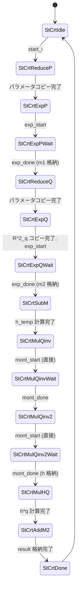

**base mod p/q の入力方式:**
base（2048bit）から base mod p（1024bit）への剰余削減は、ハードウェアでの実装が
複雑なため、ホスト（ソフトウェア）側で前計算する方式を採用する。
ホストは `ParamBasP`（base mod p）と `ParamBasQ`（base mod q）を
ADDR_BASE_P / ADDR_BASE_Q に格納する。crt_controller の StCrtReduceP / StCrtReduceQ
はこれらの前計算済み値を ADDR_BASE にコピーして mod_exp に渡す。

**MulQinv の実装:**
h = qinv × h_temp mod p の計算には、crt_controller が mont_mul を **直接駆動** する。
mod_exp は累乗演算専用であり、単純な乗算には適さないため、crt_controller に
`mont_start_o` ポートを追加し、rsa_top 側で mod_exp と crt_controller の
mont_mul 起動信号を調停する。2 回の MontMul で R^{-1} 補正を行う：
1. MontMul(qinv, h_temp, p) → qinv × h_temp × R^{-1} mod p
2. MontMul(result, R^2_p, p) → qinv × h_temp mod p

**n_prime の切替:**
CRT モードでは p 系演算（ExpP, MulQinv）に np_prime、q 系演算（ExpQ）に nq_prime
を使用する。crt_controller が `use_nq_prime_o` 信号を出力し、rsa_top の
`active_n_prime` セレクタを制御する。

**mul_add_unit の共有:**
`StCrtMulHQ` では `crt_controller` が `mul_add_unit` を **直接駆動** する。
`h × q`（1024×1024→2048bit）のマルチワード乗算は schoolbook アルゴリズムで
ワード単位に実行する。この状態では `mont_mul` は Idle であるため、
mul_add_unit の使用競合は発生しない。

**状態別の他モジュール通信サマリ:**

| 状態 | 通信先 | 内容 |
|---|---|---|
| StCrtReduceP | mem (Port A) | base_p/dp/p/R^2_p を所定アドレスにコピー |
| StCrtExpP / StCrtExpPWait | mod_exp | exp_start → exp_done 待ち（mod_exp が mont_mul/mem/DSP を使用） |
| StCrtReduceQ | mem (Port A) | m1 退避、base_q/dq/q/R^2_q をコピー |
| StCrtExpQ / StCrtExpQWait | mod_exp | R^2_q コピー後 exp_start → exp_done 待ち |
| StCrtSubM | mem (Port A) | m2 退避、m1 - m2 計算、必要に応じて +p 補正 |
| StCrtMulQinv / MulQinvWait | mont_mul (直接), mem (Port A) | qinv/h_temp/p セットアップ → MontMul 1 回目 |
| StCrtMulQinv2 / Qinv2Wait | mont_mul (直接), mem (Port A) | result/R^2_p セットアップ → MontMul 2 回目 |
| StCrtMulHQ | mem (Port A), mul_add_unit | h × q schoolbook 乗算（ワード単位） |
| StCrtAddM2 | mem (Port A) | result = m2 + h×q をワード単位で加算 |

**タイミングチャート:**

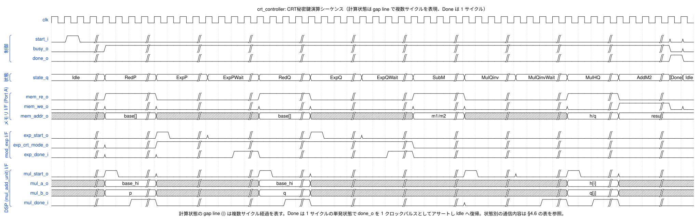

---

### 4.7 operand_mem — 共有オペランドメモリ

**責務:** 全オペランド・中間結果・演算結果を格納する BRAM ベースのデュアルポートメモリ。

**ポート定義:**

```systemverilog
module operand_mem #(
  parameter int unsigned WordWidth = 32,
  parameter int unsigned Depth     = 1024
) (
  input  logic                       clk,
  input  logic                       rst_n,
  // ポート A（読み書き — io_controller / crt_controller 使用）
  input  logic                       a_we_i,
  input  logic [$clog2(Depth)-1:0]   a_addr_i,
  input  logic [WordWidth-1:0]       a_wdata_i,
  output logic [WordWidth-1:0]       a_rdata_o,
  // ポート B（読み書き — mont_mul 使用）
  input  logic                       b_we_i,
  input  logic [$clog2(Depth)-1:0]   b_addr_i,
  input  logic [WordWidth-1:0]       b_wdata_i,
  output logic [WordWidth-1:0]       b_rdata_o
);
```

**BRAM 構成:**
- True Dual-Port BRAM36K × 1
- 1024 × 32bit = 32,768 bit（BRAM36K の 36,864 bit に収容）
- ポート A: I/O コントローラと CRT コントローラが共有（排他制御は rsa_top の FSM で保証）
- ポート B: モンゴメリ乗算器が専有

デュアルポート採用の根拠（シングルポートとの比較、性能影響、コスト）は §11.5 を参照。

---

## 5. データフロー

### 5.1 公開鍵演算（mode_i = 0）

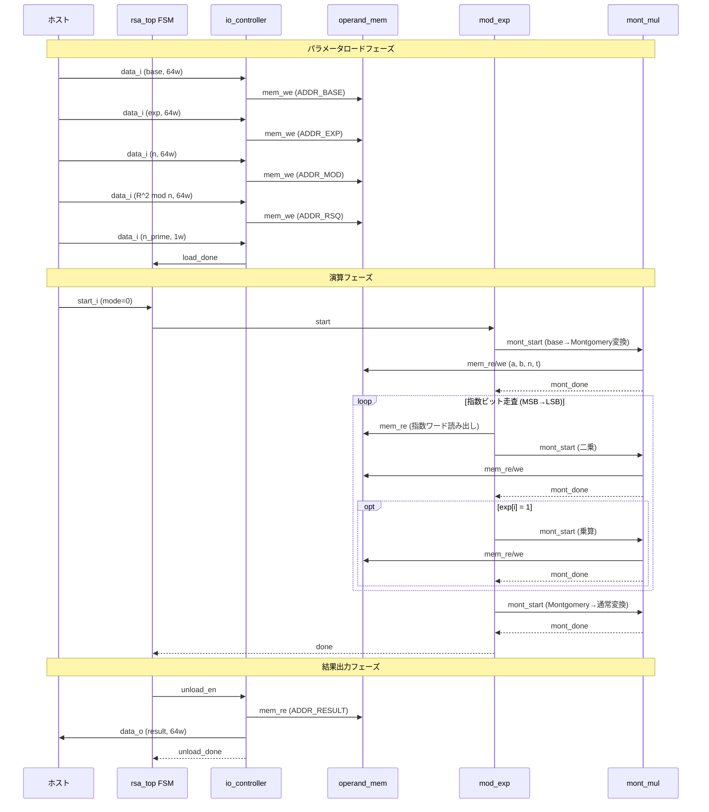

### 5.2 秘密鍵演算（CRT, mode_i = 1）

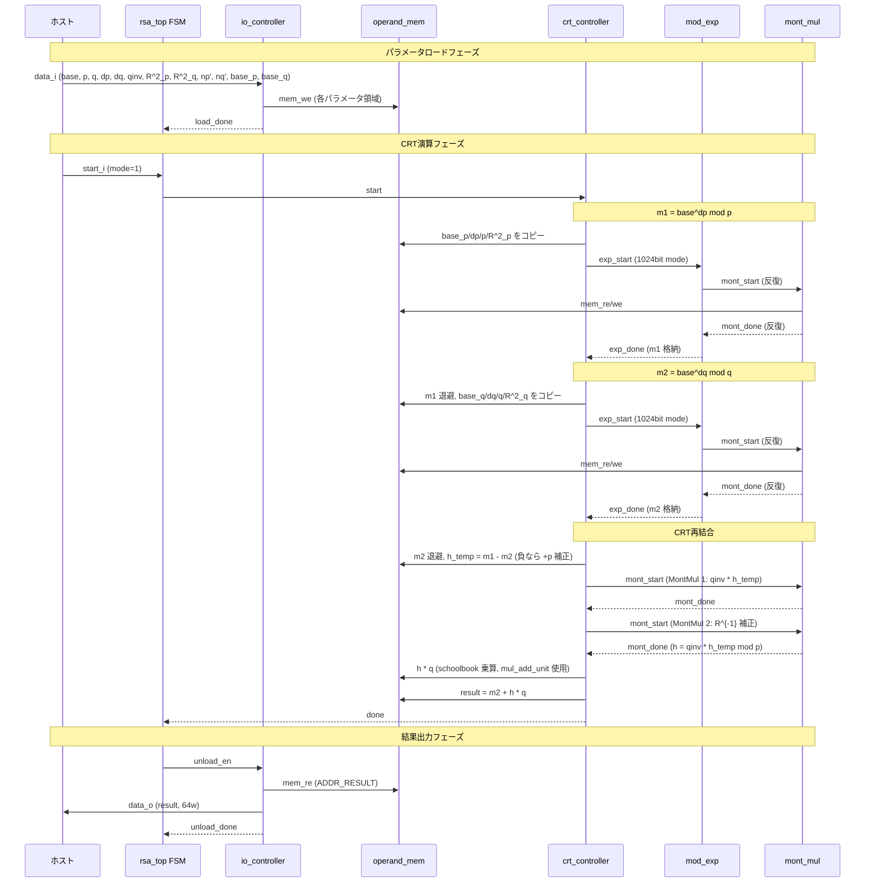

---

## 6. リソース見積り

### 6.1 FPGA リソース（Spartan-7 XC7S25）

| リソース | 使用見込み | 利用可能 | 使用率 |
|---|---|---|---|
| LUT | ~4,000-6,000 | 14,600 | ~30-40% |
| FF | ~2,000-3,000 | 29,200 | ~10% |
| DSP48E1 | 1-2 | 45 | 2-4% |
| BRAM36K | 1 | 30 | 3% |

設計は BRAM・DSP ともに余裕があり、AXI-Lite ラッパーや
その他のシステムロジックのための空間が十分に残る。

### 6.2 性能見積り

**モンゴメリ乗算サイクル数:**
- 2048bit（64 ワード）: 64 × 64 × 6 ≈ **24,576 サイクル**
- 1024bit（32 ワード）: 32 × 32 × 6 ≈ **6,144 サイクル**

**各演算の所要サイクル・時間（100MHz）:**

| 操作 | MontMul 回数 | サイクル/MontMul | 合計サイクル | 所要時間 |
|---|---|---|---|---|
| 公開鍵（e=65537, 17bit） | 33 | ~24,576 | ~811K | ~8.1ms |
| 公開鍵（2048bit 指数） | ~3,072 | ~24,576 | ~75.5M | ~755ms |
| 秘密鍵（CRT, 1024bit） | ~4,608+α | ~6,144 | ~28.5M | ~285ms |

CRT により 2048bit 直接累乗（~755ms）と比較して約 2.7 倍の高速化を実現。

---

## 7. RTL ファイル構成

```
rtl/
├── rsa_pkg.sv          パッケージ: アドレスマップ定数、型定義
├── rsa_top.sv          トップレベル統合
├── io_controller.sv    32bit シリアル I/O（Valid/Ready）
├── mod_exp.sv          モジュラー累乗（Square-and-Multiply）
├── mont_mul.sv         モンゴメリ乗算（FIOS, 32bit ワード）
├── mul_add_unit.sv     32×32 積和演算（DSP48E1 ラッパー）
├── crt_controller.sv   CRT オーケストレーション
└── operand_mem.sv      デュアルポート BRAM オペランドストレージ
```

---

## 8. 設計判断サマリ

| 判断項目 | 選定 | 根拠 |
|---|---|---|
| モンゴメリバリエーション | FIOS（32bit ワード） | 中間記憶最小、単一内部ループ、データバス幅と一致 |
| 累乗方式 | Left-to-right binary | 制御最シンプル、前計算テーブル不要、検証容易 |
| DSP 使用数 | 1 DSP48E1 | 最小リソース; 32×32 を 4 回の 16×16 部分積で実行（5 サイクル） |
| オペランド記憶 | 1 BRAM36K デュアルポート | 全オペランドを 1 メモリに集約、I/O と演算で調停 |
| CRT 再結合 | mont_mul を 1024bit モードで再利用 | 追加乗算器不要 |
| 幅切替 | half_mode 信号 | 単一の mont_mul インスタンスで 2048/1024 両対応 |
| 最終条件付き減算 | mont_mul 内で減算+比較 | モンゴメリ剰余の正当性に必要 |
| addr_i セマンティクス | パラメータ ID + IP 内部ワードカウンタ方式 | 外部フルアドレス方式に対し、転送境界の検出容易性・パラメータ単位アトミック性・ピン数削減・誤アドレス耐性で優位（§11.4） |
| BRAM ポート構成 | True Dual-Port BRAM36K × 1 | mont_mul の FIOS 内部ループで R/W 並列化により実効 ~6 サイクル/j を達成。Xilinx 7シリーズでデュアルポート化のコストはほぼゼロ（§11.5） |
| Montgomery ドメイン変換 | MontMul(a, R^2 mod n, n) / MontMul(a, 1, n) | 専用変換器を作らず mont_mul を再利用（§11.3） |

---

## 9. リスクと対策

| リスク | 影響 | 対策 |
|---|---|---|
| 100MHz でのタイミングクロージャ | 32bit キャリーチェインが長くなる可能性 | 蓄積パスをパイプライン化、DSP48E1 出力をレジスタ |
| メモリポート競合 | 指数走査とモンゴメリ内部ループが同時アクセス | デュアルポート BRAM; 指数ビットはシフトレジスタにラッチ |
| CRT 再結合の複雑性 | h×q は 1024×1024→2048bit で通常の MontMul ではない | crt_controller 内で mul_add_unit を再利用したマルチワード乗算を実装 |
| モンゴメリ剰余の正当性 | ワードインデックスの off-by-one エラーが起きやすい | NIST/OpenSSL のテストベクタによる網羅的検証 |

---

## 10. 要求仕様トレーサビリティ

| 要求仕様項目 | 設計での対応 |
|---|---|
| 全操作を単一エンジンで実現 | mod_exp + mont_mul で全演算を処理 |
| CRT 対応 | crt_controller が 1024bit 演算×2 + 再結合を制御 |
| 32bit シリアル I/O | io_controller が Valid/Ready で 32bit 転送 |
| Valid/Ready ハンドシェイク | io_controller の入出力ポートに実装 |
| Active-Low 非同期リセット | 全モジュールで rst_n 使用 |
| 100MHz 動作 | リソース見積りで Spartan-7 に収まることを確認 |
| Arty S7-25 対応 | BRAM 1個 + DSP 1-2個 で XC7S25 に収容可能 |

---

## 11. 設計判断詳細

### 11.1 モンゴメリ乗算: FIOS（Finely Integrated Operand Scanning）

2048bit のモジュラー乗算を効率的に実行するため、モンゴメリ乗算を採用する。
モンゴメリ乗算の複数のバリエーションの中から FIOS を選定した。

| バリエーション | 特徴 | Spartan-7 適性 |
|---|---|---|
| Radix-2 | 最もシンプル、~2048サイクル/乗算 | 遅すぎる |
| Radix-4 | Radix-2の2倍速 | まだ遅い |
| SOS（Separated OS） | ステップが明確に分離 | 中間記憶が大きい |
| CIOS（Coarsely Integrated OS） | バランス型 | 良好 |
| **FIOS（Finely Integrated OS）** | **単一内部ループ、中間記憶最小** | **最適** |

**選定理由:**
1. 単一の融合内部ループにより、SOS/CIOS と比較して中間記憶レジスタが少ない
2. 32bit ワードサイズがデータバス幅と一致し、入力ロードとモンゴメリワード処理が同じ粒度
3. DSP48E1 を 1 個使用するだけで核となる 32×32 乗算を実行可能
4. 一時記憶はキャリー 1 ワード分のみ（SOS は s ワード配列が必要）

**FIOS アルゴリズム（疑似コード）:**

```
入力: a[0..s-1], b[0..s-1], n[0..s-1], n'[0]  （s = 64 words for 2048bit）
出力: t[0..s-1] = a * b * R^(-1) mod n

for i = 0 to s-1:
    // 初期積和
    (C, S) = t[0] + a[0] * b[i]
    m = S * n'[0] mod W                // W = 2^32
    (C, S) = S + m * n[0]              // S は 0 になる（設計上保証）

    // 内部ループ
    for j = 1 to s-1:
        (C, S) = t[j] + a[j] * b[i] + C
        (C, S) = S + m * n[j] + C
        t[j-1] = S

    t[s-1] = C

// 最終条件付き減算
if t >= n then t = t - n
```

### 11.2 モジュラー累乗: Left-to-right binary（Square-and-Multiply）

| 方式 | 特徴 | 選定 |
|---|---|---|
| **Left-to-right binary** | **最もシンプル、前計算テーブル不要** | **採用** |
| Sliding window | 乗算回数 15-25% 削減、BRAM にテーブル必要 | 不採用 |
| m-ary | 同上 | 不採用 |

**選定理由:**
- 制御ロジックが最もシンプルで検証が容易
- 追加メモリ（前計算テーブル）が不要で BRAM を節約
- 教育・学習目的のプロジェクトにおいて理解しやすい

**アルゴリズム（疑似コード）:**

```
入力: base, exp, n, R^2 mod n, n'[0]
出力: base^exp mod n

// Step 1: モンゴメリドメインへ変換
A = MontMul(base, R^2 mod n, n)        // A = base * R mod n

// Step 2: 結果の初期化
result = MontMul(1, R^2 mod n, n)      // result = R mod n（1のモンゴメリ形式）

// Step 3: Square-and-Multiply（MSB から LSB へ走査）
for i = (bit_width - 1) downto 0:
    result = MontMul(result, result, n)  // 二乗
    if exp[i] == 1:
        result = MontMul(result, A, n)   // 乗算

// Step 4: モンゴメリドメインから復帰
result = MontMul(result, 1, n)          // result * R^(-1) mod n
```

### 11.3 モンゴメリドメイン変換

モンゴメリ乗算を使用するため、演算前後でドメイン変換が必要。

| 変換 | 演算 | 備考 |
|---|---|---|
| 通常→モンゴメリ | `a_mont = MontMul(a, R^2 mod n, n)` | R^2 mod n は外部で前計算 |
| モンゴメリ→通常 | `a = MontMul(a_mont, 1, n)` | |

**外部（ホスト）で前計算して入力するパラメータ:**
- `R^2 mod n` : R = 2^2048（公開鍵演算用）
- `n'[0]` : `-n^(-1) mod 2^32`
- CRT 用: `R^2 mod p`, `R^2 mod q`, `-p^(-1) mod 2^32`, `-q^(-1) mod 2^32`
- CRT 用: `base mod p`, `base mod q`（2048bit→1024bit の剰余削減はホスト側で実行）

### 11.4 外部インターフェース: addr_i セマンティクス

`rsa_top` の `addr_i[3:0]` は **ワードアドレスではなくパラメータ ID**
（`rsa_pkg::param_addr_e`）として扱う。1 つのパラメータ転送中、
ホスト側は `addr_i` を同じ値に保持し、io_controller が内部で
ワードカウンタ（`word_cnt`）を Valid/Ready ハンドシェイク成立ごとに
0 → N-1 までインクリメントする。実際のメモリアドレスは次式で生成する：

```
mem_addr_o = param_base_addr(addr_i) + word_cnt
```

ここで `param_base_addr()` は `param_addr_e` から物理ベースアドレスへの
デコーダ（定数テーブル）である。

**方式比較:**

| 観点 | パラメータ ID + 内部カウンタ（採用） | 外部フルアドレス方式 |
|---|---|---|
| `addr_i` ビット幅 | 4bit（パラメータ ID 16 種） | 10bit（1024 ワード空間） |
| ホスト側ロジック | パラメータごとに `addr_i` を 1 回設定するだけ | ホスト側でワードカウンタが必要 |
| 転送境界の検出 | `(word_cnt == N-1)` で load_done をパルス生成 | 境界情報がバス上に無い／別途 last 信号が必要 |
| 誤アドレスリスク | パラメータ領域外への書き込み不可（デコーダが安全側） | ホストのアドレス誤りで任意領域を上書きし得る |
| 転送順序 | LSB-first を IP 側で強制 | ホスト側の責務、間違いやすい |
| ピン数 | 少ない（組込み用途向き） | 多い |

**「外部からアドレスを毎回インクリメントし、内部では自動カウントしない」方式の問題点:**

1. **転送境界情報の喪失** — パラメータ転送の最終ワードを IP が知る手段が無いため、
   `load_done` を生成するには別途 `last_i` 信号が必要。
2. **パラメータ単位のアトミック性が崩れる** — ホスト側のアドレス計算ミスで
   複数パラメータ領域にまたがる書き込みが発生し得る。
3. **ホスト側ドライバが複雑化** — 毎ワードごとにアドレスを計算する必要があり、
   DMA 転送との親和性も低い。
4. **ピン数増加** — `addr_i` が 4bit → 10bit に拡大。

以上より、IP 内部カウンタ方式は組込み RSA アクセラレータの典型的ユースケース
（ホスト CPU が 1 パラメータずつ順次ロードする）にマッチし、インターフェース
シンプル性とエラー耐性の両面で優位である。

**転送シーケンス例（n のロード, N=64）:**

```
cycle : 0        1       2              63      64
addr_i: n        n       n      ...     n        X      (ホストは同じ値を保持)
data_i: w0       w1      w2     ...     w63      X
word_cnt (内部): 0 →     1 →    2 →     63  →   (load_done パルス, 0 に戻る)
mem_addr_o:      n_base  +0     +1      ...  +63
```

### 11.5 オペランドメモリ: デュアルポート BRAM の選定

`operand_mem` には **デュアルポート BRAM36K**（Port A: io_controller /
crt_controller、Port B: mont_mul）を採用する。高レベルで見ると
io_controller のロード期間、mont_mul の演算期間、crt_controller の CRT 統括
期間は相互排他（同時実行しない）ため、単一ポート BRAM でも機能的には
成立する。それでもデュアルポートを採用したのは **mont_mul 内部ループの
スループットがシングルポートでは大きく低下する** ためである。

**FIOS 内部ループのメモリアクセスパターン（1 回の `j` イテレーション）:**

```
1. read  a[j]      （次の積和 a[j]*b[i] 用）
2. read  n[j]      （モンゴメリ還元 m*n[j] 用）
3. read  t[j]      （積和対象の中間値）
4. write t[j-1]    （1 つ前のスロットへ更新結果を書き戻し）
```

1 イテレーション当たり **読み出し 3 回 + 書き込み 1 回 = 4 メモリアクセス**。
mul_add_unit の 5 サイクル演算とパイプライン整合させるため、
`j` 当たり実効 6 サイクルを目標とする。

**シングルポート vs デュアルポート比較:**

| 観点 | デュアルポート BRAM（採用） | シングルポート BRAM |
|---|---|---|
| 内部ループ実効サイクル/j | ~6 サイクル | ~9〜10 サイクル（R/W シリアル化） |
| 2048bit MontMul 1 回のサイクル数 | ~24,576 | ~37,000〜41,000 |
| 公開鍵(e=65537) 総時間 @100MHz | ~811K cycle ≈ 8.1 ms | ~1.3M cycle ≈ 13 ms |
| BRAM36K 使用数 | 1 個 | 1 個（同じ） |
| LUT/FF コスト | ほぼ同等（アドレスデコードの差程度） | ほぼ同等 |
| Port B 側の使途 | mont_mul 専用（読み書き両対応） | — |
| 制御の複雑度 | Port 分離によりアービトレーション不要 | ロード/アンロード時のポート占有制御は不要（シリアル実行なので自明） |

**結論:**
- BRAM36K は Xilinx 7 シリーズではネイティブにデュアルポート対応であり、
  デュアルポート化による **物理コストはほぼゼロ**（BRAM 1 個で変わらない）。
- 一方、内部ループのシリアル化によるスループット低下は **性能に 40〜60%
  影響する**（公開鍵演算 8.1ms → 13ms 相当）。
- 性能影響に対してコストがほぼ無いため、デュアルポートを採用する。
- 将来 AXI-Lite ラッパーから DMA でバックグラウンドロードしたくなった
  場合にも、Port A 側が空いていればそのまま拡張可能。

**相互排他に関する補足:**
io_controller / crt_controller と mont_mul は確かに時系列上は排他実行
されるが、mont_mul 単体の内部ループで Port A（アイドル）と Port B
（書き込み用）を同時使用することで、実効スループットを稼いでいる。
よって本設計におけるデュアルポートの主目的は「複数モジュールの同時
アクセス」ではなく「mont_mul 内部ループの読み書き並列化」である。
